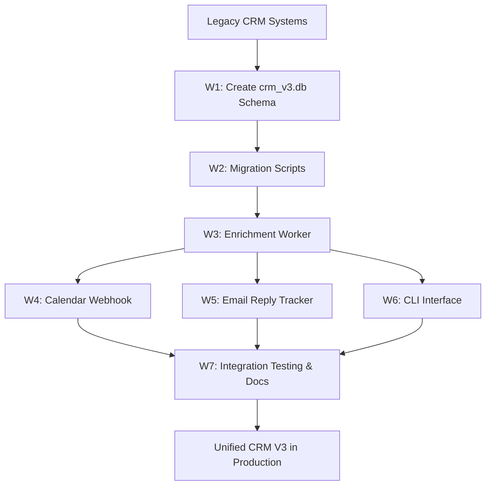

# CRM V3 Unified Orchestrator

```yaml
capability_id: crm-v3-unified-orchestrator
name: "CRM V3 Unified Orchestrator"
category: orchestrator
status: active
confidence: medium
last_verified: 2025-11-29
tags:
  - crm
  - relationships
  - enrichment
  - calendar
  - gmail
entry_points:
  - type: script
    id: "N5/builds/crm-v3-unified/ORCHESTRATOR_PLAN.md"
  - type: script
    id: "N5/builds/crm-v3-unified/ORCHESTRATOR_MONITOR.md"
  - type: prompt
    id: "Prompts/crm-enrich-profile.prompt.md"
  - type: prompt
    id: "Prompts/crm-gmail-enrichment.prompt.md"
  - type: agent
    id: "Gmail Sent Folder Contact Extraction"
owner: "V"
```

## What This Does

Coordinates the migration and unification of three legacy CRM surfaces into **CRM V3**: a single SQLite-backed, YAML-first, webhook- and queue-driven relationship intelligence system. Manages the worker phases that create the database, migrate records, run enrichment workers, attach calendar and email signals, and validate end-to-end behavior.

## How to Use It

- Use `file 'N5/capabilities/internal/crm-v3.md'` to understand the underlying data model and capabilities.
- Use this orchestrator when planning or modifying **how CRM V3 is built, migrated, or fed by external signals**.
- For architecture and worker sequencing:
  - Open `file 'N5/builds/crm-v3-unified/ORCHESTRATOR_PLAN.md'` for dependency graph and worker breakdown.
  - Open `file 'N5/builds/crm-v3-unified/ORCHESTRATOR_MONITOR.md'` for live worker status and validation commands.
- Launch or debug enrichment-related workflows via:
  - `file 'Prompts/crm-enrich-profile.prompt.md'` – enrichment workflow for individual profiles.
  - `file 'Prompts/crm-gmail-enrichment.prompt.md'` – Gmail-thread-driven enrichment.
- For automated ingestion from Gmail sent mail, manage the **Gmail Sent Folder Contact Extraction** scheduled task via the Agents UI.

## Associated Files & Assets

- `file 'N5/builds/crm-v3-unified/ORCHESTRATOR_PLAN.md'` – high-level orchestration design
- `file 'N5/builds/crm-v3-unified/ORCHESTRATOR_MONITOR.md'` – status tracker and validation commands
- `file 'N5/builds/crm-v3-unified/crm-v3-design.md'` – architecture reference
- `file 'N5/builds/crm-v3-unified/WORKER_1_DATABASE_SCHEMA.md'` – DB schema plan
- `file 'N5/builds/crm-v3-unified/WORKER_2_MIGRATION_SCRIPTS.md'` – migration scripts brief
- `file 'N5/builds/crm-v3-unified/WORKER_3_ENRICHMENT_WORKER.md'` – enrichment worker spec
- `file 'N5/builds/crm-v3-unified/gmail_enrichment_module.py'` – Gmail enrichment implementation
- `file 'N5/builds/crm-v3-unified/gmail_integration.py'` and `file 'N5/builds/crm-v3-unified/gmail_search_cli.py'` – Gmail integrations and CLI

## Workflow



**Key behaviors:**
- Consolidates `Knowledge/crm/**`, `N5/stakeholders/**`, and `N5/data/profiles.db` into a single schema.
- Uses queue-based enrichment (`crm_enrichment_worker.py`) to add intelligence via Aviato and other sources.
- Listens to Google Calendar webhooks and Gmail events to keep relationship data current.
- Exposes a CLI and prompts so V can query and update CRM V3 directly.

## Notes / Gotchas

- Legacy systems remain in place as fallback until W7 integration testing is complete; avoid manual edits to legacy data once V3 is primary.
- Calendar webhook and email tracker workers must be healthy for **ongoing** enrichment; monitor their logs and tests via the commands in `ORCHESTRATOR_MONITOR.md`.
- When changing schema or migration behavior, update both the internal capability (`crm-v3.md`) and this orchestrator capability.
- Treat scheduled tasks that touch CRM V3 as part of this orchestrator; changes to them can affect end-to-end integrity.

