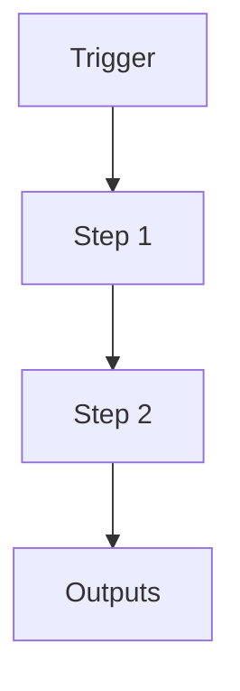

# Export Batch Workflow

```yaml
# Zone 2: Capability metadata (machine-readable)
capability_id: export-batch-workflow
name: Export Batch Workflow
category: workflow
status: active
confidence: medium
last_verified: 2025-11-30
tags:
- exports
- outbound
- workflow
- packaging
- batches
entry_points:
- type: script
  id: N5/scripts/export_manager.py
- type: incantum
  id: 'Export batch:'
owner: V
change_type: new
description: 'This capability standardizes how outbound export batches are created
  and tracked in Zo.

  It creates timestamped batch folders under `Exports/`, copies all requested payload
  files

  into them (never moves), and generates both machine-readable `metadata.yaml` and

  human-readable `MANIFEST.md` for full traceability. Other tools and prompts can
  delegate

  export assembly to this workflow, ensuring consistent structure, context capture,
  and

  easy pruning later.

  '
```

## What This Does

This capability standardizes how outbound export batches are created and tracked in Zo.
It creates timestamped batch folders under `Exports/`, copies all requested payload files
into them (never moves), and generates both machine-readable `metadata.yaml` and
human-readable `MANIFEST.md` for full traceability. Other tools and prompts can delegate
export assembly to this workflow, ensuring consistent structure, context capture, and
easy pruning later.

## How to Use It

- How to trigger it (prompts, commands, UI entry points)
- Typical usage patterns and workflows

## Associated Files & Assets

List key implementation and configuration files using `file '...'` syntax where helpful.

## Workflow

Describe the execution flow. Optionally include a mermaid diagram.



## Notes / Gotchas

- Edge cases
- Preconditions
- Safety considerations
