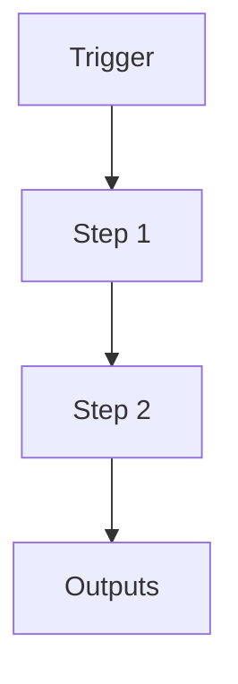

# Jobboard shortlink scan (Notion → short.io)

```yaml
# Zone 2: Capability metadata (machine-readable)
capability_id: jobboard-shortlink-scan
name: "Jobboard shortlink scan (Notion \u2192 short.io)"
category: workflow
status: active
confidence: medium
last_verified: 2025-12-13
tags:
- careerspan
- jobboard
- notion
- shortio
entry_points:
- type: script
  id: N5/scripts/jobboard_scan.py
- type: prompt
  id: Prompts/Jobboard Scan.prompt.md
owner: V
change_type: new
capability_file: N5/capabilities/workflows/jobboard-shortlink-scan.md
description: 'Manual, diff-based workflow that scans the Careerspan Notion job board
  and creates short.io links for any untracked jobs.

  Slugs are generated deterministically based on hiring type (jb/pt/it/tc), company,
  role, and optional location for collision resolution.

  Writes an append-only tracking log so subsequent runs are incremental.

  '
associated_files:
- N5/scripts/jobboard_scan.py
- N5/scripts/shortio_link_service.py
- Prompts/Jobboard Scan.prompt.md
- N5/data/jobboard_links.jsonl
- N5/data/jobboard_cache.json
```

## What This Does

Manual, diff-based workflow that scans the Careerspan Notion job board and creates short.io links for any untracked jobs.
Slugs are generated deterministically based on hiring type (jb/pt/it/tc), company, role, and optional location for collision resolution.
Writes an append-only tracking log so subsequent runs are incremental.

## How to Use It

- How to trigger it (prompts, commands, UI entry points)
- Typical usage patterns and workflows

## Associated Files & Assets

List key implementation and configuration files using `file '...'` syntax where helpful.

## Workflow

Describe the execution flow. Optionally include a mermaid diagram.



## Notes / Gotchas

- Edge cases
- Preconditions
- Safety considerations
