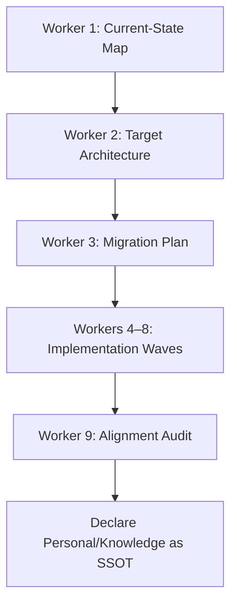

# Knowledge Realignment v1 Workflow

```yaml
capability_id: knowledge-realignment-v1-workflow
name: "Knowledge Realignment v1 Workflow"
category: workflow
status: active
confidence: medium
last_verified: 2025-11-29
tags:
  - knowledge
  - migration
  - architecture
  - ssot
entry_points:
  - type: script
    id: "N5/builds/knowledge-realignment-v1/ORCHESTRATOR_MONITOR.md"
owner: "V"
```

## What This Does

Multi-phase workflow to **realign the entire knowledge system** onto a single source of truth (`Personal/Knowledge/`). Migrates legacy knowledge surfaces, updates scripts and prompts to new paths, and performs a post-migration audit to ensure all systems point at the correct locations.

## How to Use It

- Use this capability when reasoning about **knowledge architecture changes**, migrations, or cleanup.
- Start from `file 'N5/builds/knowledge-realignment-v1/ORCHESTRATOR_MONITOR.md'` to see worker status and pending tasks.
- Review design and plans in:
  - `file 'N5/builds/knowledge-realignment-v1/knowledge-realignment-v1-design.md'`
  - Worker briefs under `N5/builds/knowledge-realignment-v1/WORKER_*_*.md`.
- For operational checks, use monitoring commands in the monitor file (e.g., `ls -R Personal/Knowledge` and legacy inbox scans).

## Associated Files & Assets

- `file 'N5/builds/knowledge-realignment-v1/ORCHESTRATOR_MONITOR.md'` – worker list and integration checklist
- `file 'N5/builds/knowledge-realignment-v1/knowledge-realignment-v1-design.md'` – architecture + phases
- `file 'N5/builds/knowledge-realignment-v1/WORKER_1_current_state_map.md'` – pre-migration map
- `file 'N5/builds/knowledge-realignment-v1/WORKER_2_target_architecture.md'` – target layout
- `file 'N5/builds/knowledge-realignment-v1/WORKER_3_migration_plan.md'` – concrete plan
- `file 'N5/builds/knowledge-realignment-v1/WORKER_9_alignment_audit.md'` – final audit brief
- `file 'Personal/Knowledge/Architecture/principles/architectural_principles.md'` – canonical principles referenced in this project

## Workflow



**High-level phases:**
- Phase 1–3: Map current state, design target, and plan migration.
- Phase 4–8: Migrate CRM, intelligence, world/market, frameworks, and canonical content into `Personal/Knowledge/**`.
- Phase 9: Run alignment audit, update dependent scripts/prompts, and confirm SSOT + meeting SSOT are correctly documented.

## Notes / Gotchas

- This workflow changes **paths referenced across many systems** (GTM, CRM, prompts); Worker 9 is critical for catching stragglers.
- Legacy `Knowledge/**` directories become compatibility shells; avoid adding new content there.
- When building new knowledge-related capabilities, always assume `Personal/Knowledge/` is canonical and reference this workflow for migration history.

