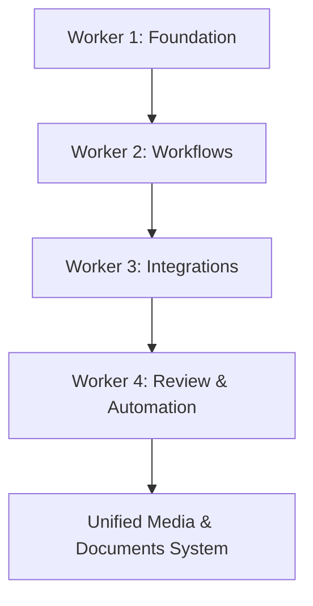

# Media & Documents System Orchestrator

```yaml
capability_id: media-documents-system-orchestrator
name: "Media & Documents System Orchestrator"
category: orchestrator
status: experimental
confidence: medium
last_verified: 2025-11-29
tags:
  - media
  - documents
  - ingestion
  - tracking
entry_points:
  - type: script
    id: "N5/builds/media-documents-system/BUILD_MANIFEST.md"
  - type: script
    id: "N5/scripts/conversation_orchestrator.py"
owner: "V"
```

## What This Does

Orchestrates the build of a **unified media & documents system** that tracks and processes external media (audio/video) and internal documents using a shared database and taxonomy. Defines worker phases for foundation, workflows, integrations, and scheduled automation around media/doc handling.

## How to Use It

- Use this when planning or resuming work on the media/documents architecture.
- Start with `file 'N5/builds/media-documents-system/BUILD_MANIFEST.md'` to understand workers, timing, and the controlling orchestrator conversation.
- To run the orchestrator from a build thread, follow the command in the manifest:
  - `python3 /home/workspace/N5/scripts/conversation_orchestrator.py media-documents-system --orchestrator-id con_L3ITnGAwWvfxEKz3`
- Worker briefs in the same folder (`WORKER_1_FOUNDATION.md`, `WORKER_2_WORKFLOWS.md`, etc.) define concrete deliverables for each phase.

## Associated Files & Assets

- `file 'N5/builds/media-documents-system/BUILD_MANIFEST.md'` – project overview + orchestrator command
- `file 'N5/builds/media-documents-system/WORKER_1_FOUNDATION.md'` – DB + taxonomy
- `file 'N5/builds/media-documents-system/WORKER_2_WORKFLOWS.md'` – workflow scripts
- `file 'N5/builds/media-documents-system/WORKER_3_INTEGRATIONS.md'` – integrations with other systems
- `file 'N5/builds/media-documents-system/WORKER_4_REVIEW_SYSTEM.md'` – review & automation
- `file 'N5/scripts/conversation_orchestrator.py'` – generic orchestrator runner

## Workflow



**Phases:**
- Worker 1: Create database, taxonomy, and perform any initial migration.
- Worker 2: Implement 8+ core workflows for ingest, tagging, and retrieval.
- Worker 3: Connect to other systems (meeting pipeline, content library, knowledge surfaces).
- Worker 4: Configure scheduled tasks, audits, and validation.

## Notes / Gotchas

- Status is currently **experimental**; architecture is defined but execution may be partial.
- Treat `con_L3ITnGAwWvfxEKz3` as the canonical orchestrator conversation when reviewing history.
- When implementing scripts, follow file-placement conventions from the build manifest to avoid scattering media logic.

