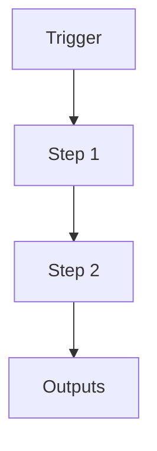

# Meeting Weekly Organization System

```yaml
# Zone 2: Capability metadata (machine-readable)
capability_id: meeting-weekly-organization
name: Meeting Weekly Organization System
category: workflow
status: active
confidence: high
last_verified: 2025-12-15
tags:
- meetings
- organization
- automation
entry_points:
- type: script
  id: N5/scripts/meeting_weekly_organizer.py
- type: agent
  id: Auto-organize meetings into weekly folders
owner: V
change_type: new
capability_file: N5/capabilities/workflows/meeting-weekly-organization.md
description: "Automatically organizes meetings from Inbox into weekly folders (Week-of-YYYY-MM-DD).\n\
  Runs 4x/day via scheduled agent. Replaces old [M] \u2192 [P] \u2192 Archive manual\
  \ pipeline.\nOnly moves processed meetings ([M]/[P] suffix), leaving raw for MG-1.\n"
associated_files:
- N5/scripts/meeting_weekly_organizer.py
- Prompts/Meeting Manifest Generation.prompt.md
- Prompts/Meeting Intelligence Generator.prompt.md
```

## What This Does

Automatically organizes meetings from Inbox into weekly folders (Week-of-YYYY-MM-DD).
Runs 4x/day via scheduled agent. Replaces old [M] → [P] → Archive manual pipeline.
Only moves processed meetings ([M]/[P] suffix), leaving raw for MG-1.

## How to Use It

- How to trigger it (prompts, commands, UI entry points)
- Typical usage patterns and workflows

## Associated Files & Assets

List key implementation and configuration files using `file '...'` syntax where helpful.

## Workflow

Describe the execution flow. Optionally include a mermaid diagram.



## Notes / Gotchas

- Edge cases
- Preconditions
- Safety considerations
