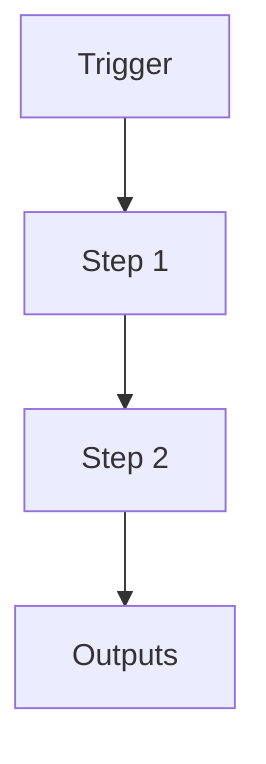

# Meeting Weekly Organization System

```yaml
# Zone 2: Capability metadata (machine-readable)
capability_id: meeting-weekly-organization
name: Meeting Weekly Organization System
category: workflow
status: active
confidence: high
last_verified: 2025-12-15
tags:
- meetings
- organization
- automation
entry_points:
- type: script
  id: N5/scripts/meeting_weekly_organizer.py
  args: --execute  # REQUIRED - script defaults to dry-run without this
- type: agent
  id: 9b813d5c-187b-4293-bb4f-652319043704
  title: Weekly Meeting Organization [v2]
owner: V
change_type: new
capability_file: N5/capabilities/workflows/meeting-weekly-organization.md
description: "Automatically organizes meetings from Inbox into weekly folders (Week-of-YYYY-MM-DD).\n\
  Runs 4x/day via scheduled agent. Replaces old [M] \u2192 [P] \u2192 Archive manual\
  \ pipeline.\nOnly moves processed meetings ([M]/[P] suffix), leaving raw for MG-1.\n"
associated_files:
- N5/scripts/meeting_weekly_organizer.py
- Prompts/Meeting Manifest Generation.prompt.md
- Prompts/Meeting Intelligence Generator.prompt.md
```

## What This Does

Automatically organizes meetings from Inbox into weekly folders (Week-of-YYYY-MM-DD).
Runs 2x/day via scheduled agent (3:30 AM, 3:30 PM ET). 
Only moves meetings with `manifest.json` status=processed.

**CRITICAL:** Script defaults to dry-run. Must pass `--execute` flag to actually move files.

## How to Use It

**Manual execution:**
```bash
# Preview what will be moved
python3 /home/workspace/N5/scripts/meeting_weekly_organizer.py --dry-run

# Actually move meetings
python3 /home/workspace/N5/scripts/meeting_weekly_organizer.py --execute
```

**Automated via agent:** Agent ID `9b813d5c-187b-4293-bb4f-652319043704` runs 2x daily.

## Associated Files & Assets

List key implementation and configuration files using `file '...'` syntax where helpful.

## Workflow

Describe the execution flow. Optionally include a mermaid diagram.



## Notes / Gotchas

- **BUG FIX (2026-01-09):** Agent was not passing `--execute` flag, causing all runs to be dry-run only. Fixed by updating agent instruction.
- Script defaults to `--dry-run` for safety
- Meetings must have `manifest.json` with `status: processed` to be moved
- Edge case: meetings without parseable dates go to `Unknown-Week/`
- Test/demo meetings get moved alongside real meetings (consider quarantine cleanup)


