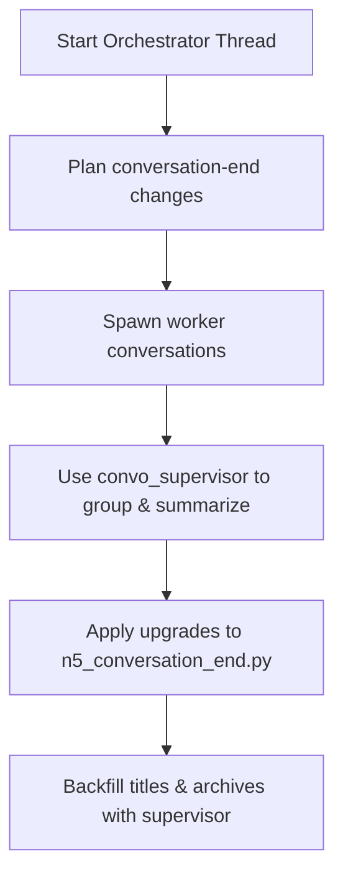

# Orchestrator Thread Workflow

```yaml
capability_id: orchestrator-thread-workflow
name: "Orchestrator Thread – Conversation-End Consistency"
category: workflow
status: active
confidence: medium
last_verified: 2025-11-29
tags:
  - system
  - orchestration
  - conversation-end
entry_points:
  - type: prompt
    id: "Prompts/Orchestrator Thread.prompt.md"
  - type: script
    id: "N5/scripts/convo_supervisor.py"
owner: "V"
```

## What This Does

Provides a **single control thread** for coordinating multi-conversation upgrades around conversation-end behavior: title generation, SESSION_STATE enrichment, supervisor workflows, and diagnostics. It standardizes how build threads that touch `n5_conversation_end.py` and related systems are coordinated and monitored.

## How to Use It

- Create a dedicated build conversation titled e.g. `Orchestrator: Conversation-End Consistency`.
- Load `@Orchestrator Thread` (`file 'Prompts/Orchestrator Thread.prompt.md'`) and pin it to that thread.
- Use the recipe to:
  - Plan changes to conversation-end behavior.
  - Coordinate worker conversations and link them back to the orchestrator thread.
  - Run the supervisor script `file 'N5/scripts/convo_supervisor.py'` to group related conversations, propose titles, and manage archives.

## Associated Files & Assets

- `file 'Prompts/Orchestrator Thread.prompt.md'` – main workflow definition
- `file 'N5/scripts/n5_conversation_end.py'` – conversation-end handler
- `file 'N5/scripts/convo_supervisor.py'` – supervisor CLI for related conversations
- `file 'N5/config/conversation_types.json'` – conversation-type config
- `file 'Recipes/System/Conversation Diagnostics.md'` – diagnostics recipe
- `file 'Documents/System/ORCHESTRATOR_QUICK_REFERENCE.md'` – quick reference

## Workflow



## Notes / Gotchas

- This workflow is **coordination-only**; it should not embed implementation details of specific features.
- Always keep the Orchestrator Thread as the anchor when making distributed changes to conversation-end behavior.
- Use dry-run modes in `convo_supervisor.py` for rename/archive operations before executing.

