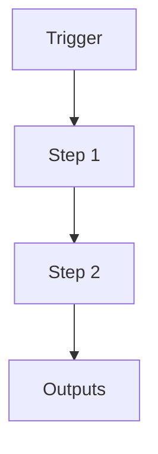

# Spawn Worker System (Parallel Threads)

```yaml
# Zone 2: Capability metadata (machine-readable)
capability_id: spawn-worker-system
name: Spawn Worker System (Parallel Threads)
category: orchestrator
status: active
confidence: high
last_verified: 2025-12-11
tags:
- orchestration
- parallel-processing
- llm-automation
- context-management
entry_points:
- type: script
  id: N5/scripts/spawn_worker.py
  description: Core spawning logic with LLM-first context injection
- type: script
  id: N5/scripts/n5_launch_worker.py
  description: CLI launcher with wizard and type presets
- type: prompt
  id: Prompts/Spawn Worker.prompt.md
  description: LLM instructions for spawning workers
owner: V
change_type: new
capability_file: N5/capabilities/internal/spawn-worker-system.md
description: 'A system for spawning parallel worker threads (conversations) with rich
  semantic context inheritance.


  Key features:

  - **LLM-First Context:** LLM provides structured JSON context (Focus, Objective,
  Status) instead of relying on regex parsing.

  - **Session State Integration:** Automatically links child threads to parents and
  initializes their state.

  - **Worker Types:** Supports specialized worker profiles (build, research, analysis).

  - **Updates:** v2.1 implementation fixes context loss issues and standardizes the
  parent-child contract.

  '
associated_files:
- N5/scripts/spawn_worker.py
- N5/scripts/n5_launch_worker.py
- N5/scripts/session_state_manager.py
- Prompts/Spawn Worker.prompt.md
- Knowledge/reasoning-patterns/llm-first-script-design.md
```

## What This Does

A system for spawning parallel worker threads (conversations) with rich semantic context inheritance.

Key features:
- **LLM-First Context:** LLM provides structured JSON context (Focus, Objective, Status) instead of relying on regex parsing.
- **Session State Integration:** Automatically links child threads to parents and initializes their state.
- **Worker Types:** Supports specialized worker profiles (build, research, analysis).
- **Updates:** v2.1 implementation fixes context loss issues and standardizes the parent-child contract.

## How to Use It

- How to trigger it (prompts, commands, UI entry points)
- Typical usage patterns and workflows

## Associated Files & Assets

List key implementation and configuration files using `file '...'` syntax where helpful.

## Workflow

Describe the execution flow. Optionally include a mermaid diagram.



## Notes / Gotchas

- Edge cases
- Preconditions
- Safety considerations
