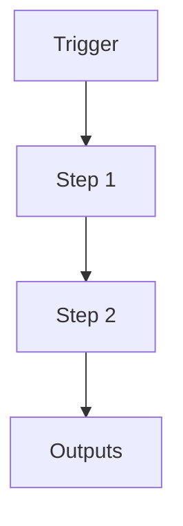

# Spawn Worker v2

```yaml
# Zone 2: Capability metadata (machine-readable)
capability_id: spawn-worker-v2
name: Spawn Worker v2
category: workflow
status: active
confidence: high
last_verified: 2025-12-11
tags:
- parallelism
- worker
entry_points:
- type: script
  id: N5/scripts/n5_launch_worker.py
- type: script
  id: N5/scripts/spawn_worker.py
owner: V
change_type: update
description: 'Parallel worker spawning system. Updated to use Inverted Intelligence
  (external prompt files) for worker instructions.

  '
associated_files:
- N5/scripts/n5_launch_worker.py
- N5/scripts/spawn_worker.py
- Prompts/Workers/*.prompt.md
```

## What This Does

Parallel worker spawning system. Updated to use Inverted Intelligence (external prompt files) for worker instructions.

## How to Use It

- How to trigger it (prompts, commands, UI entry points)
- Typical usage patterns and workflows

## Associated Files & Assets

List key implementation and configuration files using `file '...'` syntax where helpful.

## Workflow

Describe the execution flow. Optionally include a mermaid diagram.



## Notes / Gotchas

- Edge cases
- Preconditions
- Safety considerations
