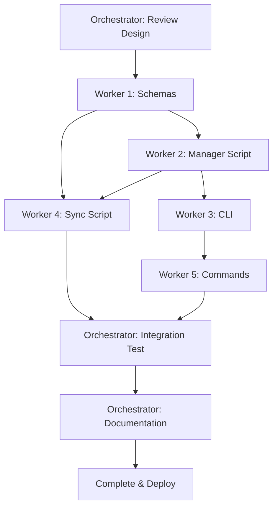

# Output Review Tracker - Orchestrator Implementation Plan

**Version:** 1.0  
**Date:** 2025-10-17  
**Model:** Orchestrator-Worker  
**Orchestrator:** con_YSy4ld4J113LZQ9A  
**Estimated Time:** 2.7 hours

---

## Overview

Deploy Output Review Tracker using orchestrator-worker model. This conversation (con_YSy4ld4J113LZQ9A) acts as orchestrator, delegating discrete implementation tasks to worker conversations, then integrating and testing the final system.

---

## Worker Assignments

### Worker 1: Schema & Infrastructure
**Task:** Create schemas and core data structures  
**Deliverables:**
- `N5/schemas/output-review.schema.json`
- `N5/schemas/output-review-comment.schema.json`  
- `Lists/output_reviews.jsonl` (empty with header comment)
- `Lists/output_reviews_comments.jsonl` (empty with header comment)
- `Lists/output_reviews.sheet.json` (spreadsheet view)
- Schema validation in `N5/scripts/n5_schema_validation.py`

**Success Criteria:**
- ✓ Both schemas validate against JSON Schema Draft 2020-12
- ✓ JSONL files created with proper structure comments
- ✓ Spreadsheet includes all key columns (id, title, type, status, sentiment, tags)
- ✓ Validation script can check entries against schema

**Time Estimate:** 30 min  
**Dependencies:** None  
**Files to Reference:** 
- `file '/home/.z/workspaces/con_YSy4ld4J113LZQ9A/output-review-schema-full.json'`
- `file '/home/.z/workspaces/con_YSy4ld4J113LZQ9A/output-review-comment-schema.json'`
- `file 'N5/schemas/lists.item.schema.json'` (reference)

---

### Worker 2: Core Manager Script
**Task:** Implement review_manager.py with CRUD operations  
**Deliverables:**
- `N5/scripts/review_manager.py`
- Unit tests for add/update/list/get operations
- Logging and error handling
- Auto-provenance detection (conversation_id from env)

**Success Criteria:**
- ✓ Can add new review entries with full provenance
- ✓ Can update status/sentiment/tags
- ✓ Can list with filters (status, sentiment, type, tags)
- ✓ Can get single entry by ID
- ✓ Validates against schema before write
- ✓ Computes content hash for files
- ✓ Handles missing files gracefully
- ✓ Returns exit code 0 on success, 1 on error

**Time Estimate:** 60 min  
**Dependencies:** Worker 1 (schemas)  
**Files to Reference:**
- `file 'N5/scripts/n5_schema_validation.py'` (validation pattern)
- `file '/home/.z/workspaces/con_YSy4ld4J113LZQ9A/output-review-tracker-design.md'` (spec)

**Script Template:**
```python
#!/usr/bin/env python3
import argparse, logging, json, hashlib
from pathlib import Path
from datetime import datetime, timezone

logging.basicConfig(level=logging.INFO, format="%(asctime)sZ %(levelname)s %(message)s")
logger = logging.getLogger(__name__)

REVIEWS_JSONL = Path("/home/workspace/Lists/output_reviews.jsonl")
SCHEMA_PATH = Path("/home/workspace/N5/schemas/output-review.schema.json")

def add_review(title, type, reference, **kwargs) -> int:
    # Implementation with schema validation
    pass

def update_review(output_id, **updates) -> int:
    # Implementation
    pass

def list_reviews(**filters) -> int:
    # Implementation
    pass

def get_review(output_id) -> int:
    # Implementation
    pass
```

---

### Worker 3: CLI Interface
**Task:** Implement review_cli.py with user-friendly commands  
**Deliverables:**
- `N5/scripts/review_cli.py`
- Commands: add, status, comment, list, show, export
- Rich output formatting (tables for list)
- Auto-detection of conversation_id from CWD

**Success Criteria:**
- ✓ `n5 review add` works with minimal args
- ✓ `n5 review status` updates workflow state
- ✓ `n5 review list` shows formatted table
- ✓ `n5 review show` displays full entry with comments
- ✓ `n5 review comment` adds threaded comments
- ✓ `n5 review export` filters by criteria
- ✓ Help text clear and concise

**Time Estimate:** 45 min  
**Dependencies:** Worker 2 (review_manager.py)  
**Files to Reference:**
- `file '/home/.z/workspaces/con_YSy4ld4J113LZQ9A/output-review-tracker-design.md'` (CLI spec)

---

### Worker 4: Spreadsheet Sync
**Task:** Implement review_sync.py for bidirectional sync  
**Deliverables:**
- `N5/scripts/review_sync.py`
- Sync from JSONL → spreadsheet
- Sync from spreadsheet → JSONL (status/sentiment/tags only)
- Conflict detection and logging

**Success Criteria:**
- ✓ `python3 review_sync.py to-sheet` updates spreadsheet from JSONL
- ✓ `python3 review_sync.py from-sheet` updates JSONL from spreadsheet edits
- ✓ Detects conflicts (both modified) and logs warning
- ✓ Preserves all JSONL fields not in spreadsheet
- ✓ Validates before writing to JSONL

**Time Estimate:** 30 min  
**Dependencies:** Worker 1, Worker 2  
**Files to Reference:**
- `file 'N5/schemas/output-review.schema.json'`

---

### Worker 5: Commands Registration
**Task:** Add commands to commands.jsonl  
**Deliverables:**
- Entries in `N5/config/commands.jsonl` for:
  - `review-add`
  - `review-status`
  - `review-comment`
  - `review-list`
  - `review-show`
  - `review-export`
  - `review-sync`

**Success Criteria:**
- ✓ All commands registered with proper entrypoints
- ✓ Help text matches CLI design
- ✓ Tags include #review, #quality, #training

**Time Estimate:** 15 min  
**Dependencies:** Worker 3 (CLI)  
**Files to Reference:**
- `file 'N5/config/commands.jsonl'` (format)

---

## Orchestrator Integration Tasks

### Integration 1: Cross-Worker Testing
**Orchestrator Task:** Test full workflow across all worker outputs  
**Test Cases:**
1. Add review via CLI → Verify in JSONL → Verify in spreadsheet
2. Update status via CLI → Verify sync to spreadsheet
3. Edit spreadsheet → Sync to JSONL → Verify integrity
4. Add comment → Verify in JSONL and show command
5. Export with filters → Verify output format
6. Invalid data → Verify error handling

**Time Estimate:** 20 min

---

### Integration 2: Documentation
**Orchestrator Task:** Create user documentation  
**Deliverables:**
- `Documents/System/output-review-tracker.md` (user guide)
- Update `Documents/N5.md` with new system reference
- Update `N5/prefs/prefs.md` if workflow preferences needed

**Time Estimate:** 20 min

---

## Deployment Sequence



---

## Orchestrator Commands

### Assign Tasks
```bash
python3 /home/workspace/N5/scripts/orchestrator.py assign \
  "Create schemas and core data structures for Output Review Tracker. See file '/home/.z/workspaces/con_YSy4ld4J113LZQ9A/output-review-schema-full.json'" \
  --to <worker_1_id> \
  --orchestrator-id con_YSy4ld4J113LZQ9A
```

### Check Progress
```bash
python3 /home/workspace/N5/scripts/orchestrator.py check-worker <worker_id> \
  --orchestrator-id con_YSy4ld4J113LZQ9A
```

### Review Changes
```bash
python3 /home/workspace/N5/scripts/orchestrator.py review-changes <worker_id> \
  --orchestrator-id con_YSy4ld4J113LZQ9A
```

### Approve Work
```bash
python3 /home/workspace/N5/scripts/orchestrator.py approve <worker_id> \
  --orchestrator-id con_YSy4ld4J113LZQ9A
```

---

## Quality Checklist

Before final approval:
- [ ] All worker deliverables complete
- [ ] Schema validation passes for sample entries
- [ ] CLI commands work end-to-end
- [ ] Spreadsheet sync bidirectional and lossless
- [ ] Error handling tested (missing files, invalid data)
- [ ] Logging clear and actionable
- [ ] Documentation complete
- [ ] No undocumented placeholders (P21)
- [ ] Fresh thread test: Can new conversation use system? (P12)
- [ ] Principles compliance: P0, P5, P7, P15, P16, P18, P19, P21

---

## Rollback Plan

If issues arise:
1. Worker outputs isolated in conversation workspaces
2. Can selectively approve/reject individual workers
3. Schemas in design workspace remain source of truth
4. No files modified in main workspace until orchestrator approval
5. Git commit between each integration step

---

## Timeline

| Phase | Duration | Cumulative |
|-------|----------|------------|
| Worker 1 | 30 min | 0.5h |
| Worker 2 | 60 min | 1.5h |
| Worker 3 | 45 min | 2.25h |
| Worker 4 | 30 min | 2.75h |
| Worker 5 | 15 min | 3.0h |
| Integration | 20 min | 3.33h |
| Documentation | 20 min | 3.58h |
| **Total** | **220 min** | **3.7h** |

*(Original estimate: 2.7h; Orchestrator overhead adds ~1h for coordination)*

---

## Open Questions (From Design)

Carry forward to workers:
1. **Archive date**: Separate from "updated_at"?
2. **Resolver tracking**: Person who closed/archived?
3. **Comment replies**: Thread depth limit?
4. **Export format**: JSON, CSV, or both?
5. **Spreadsheet edits**: Which fields are safe to edit?

Orchestrator will clarify with V before assigning workers.

---

## Next Action

**Orchestrator (this conversation):**
1. Get V's approval on orchestrator plan
2. Clarify 5 open questions
3. Create worker conversations (or get worker IDs from V)
4. Assign Worker 1 (schemas) first
5. Monitor progress via check-worker
6. Sequentially assign Workers 2-5 as dependencies complete
7. Run integration tests
8. Final approval and deployment

**Status:** Awaiting V's approval to proceed  
**Ready to Deploy:** Yes, pending approval

---

**Created:** 2025-10-17 20:51 ET  
**Orchestrator:** con_YSy4ld4J113LZQ9A
