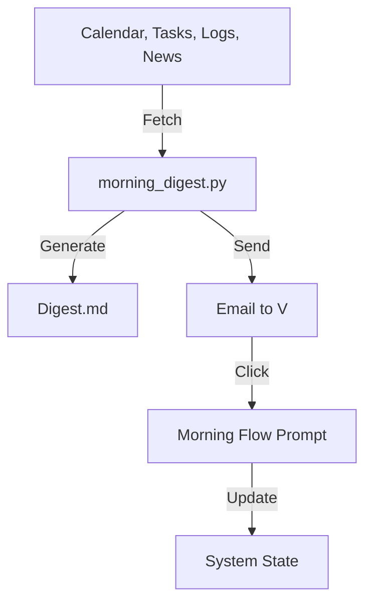

# System Design: MorningOS (Unified Daily Digest)

**Status:** Proposed
**Owner:** Vibe Architect
**Goal:** Consolidate 7+ disparate notifications into a single, high-signal 8:00 AM digest that triggers the morning workflow.

---

## 1. Problem Statement

**Current State:** "Notification Sprawl"
- 07:00 AM - Arsenal Performance Email
- 07:00 AM - File Flow Review
- 09:00 AM - Newsletter Digest
- 09:00 AM - Luma Recommendations
- 15:30 PM - Meeting Prep (Mis-timed)

**Impact:** V ignores them because they are fragmented. No single "start" button for the day.

**Desired State:** "Unified Launchpad"
- **One** email at 08:00 AM.
- Contains **all** context (Schedule, Stats, News, System Health).
- Triggers **Morning Flow** (Reflection + Planning).

---

## 2. Architecture

### Core Components

1.  **Aggregator Script (`N5/scripts/morning_digest.py`)**
    *   **Role:** The "Editor-in-Chief".
    *   **Action:** Runs at 08:00 AM.
    *   **Logic:**
        *   Fetches Calendar (Today's landscape).
        *   Fetches Tasks/Arsenal (Performance & Priorities).
        *   Fetches System Health (File Flow + Backups).
        *   Fetches External (News/Luma).
        *   Synthesizes into `N5/digests/morning-YYYY-MM-DD.md`.
        *   Emails V.

2.  **Interactive Flow (`Prompts/workflows/morning_flow.prompt.md`)**
    *   **Role:** The "Coach".
    *   **Action:** Triggered by V (e.g., "Ready for morning flow") or link in digest.
    *   **Stages:**
        1.  **Clear:** Morning Pages (Mental check-in).
        2.  **Clarify:** Review Calendar/Tasks.
        3.  **Commit:** Define Deep Work Blocks.

### Data Flow

---

## 3. Digest Structure (The "8 AM Email")

**Subject:** 🌅 [Day], [Date] — [Short 3-word Vibe/Theme]

**1. The Wedge (Inertia Breaker)**
*   Single sentence hook or key insight from yesterday's reflection.

**2. The Landscape (Today)**
*   **Calendar:** List of meetings (with [Prep Ready] indicators).
*   **Priority:** Top 3 Tasks from Arsenal/Tracker.

**3. The Pulse (System Stats)**
*   **Arsenal:** Yesterday's Score/Stats.
*   **File Flow:** "X files routed, Y pending."
*   **System:** "All backups green" (or red flag).

**4. The Horizon (Context)**
*   **News:** 3 bullet summary of Newsletter scan.
*   **Social:** 1 Luma event recommendation.

**5. The Launch (Call to Action)**
*   > "Ready to design the day? [Start Morning Flow]"

---

## 4. Migration Plan

1.  **Build** `morning_digest.py` (consolidating logic from `luma_digest`, `bulletin_generator`, etc.).
2.  **Build** `morning_flow.prompt.md` (chaining `journal.py` and new `work_block_planner`).
3.  **Verify** the new digest locally.
4.  **Scheduled Task Swap:**
    *   Create "Unified Morning Digest" (8:00 AM).
    *   Delete/Pause: Newsletter, File Flow, Arsenal Email, Meeting Prep.

---

## 5. Next Steps (Builder Handoff)

1.  **Draft** `N5/scripts/morning_digest.py` (Aggregate existing logic).
2.  **Draft** `Prompts/workflows/morning_flow.prompt.md`.
3.  **Draft** `Prompts/planning/work-block-planner.prompt.md` (Missing component).

